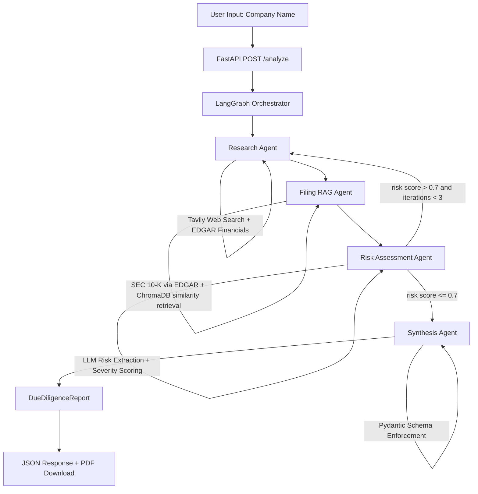

# FinSight AI

> Multi-Agent Financial Due Diligence Platform

[](https://huggingface.co/spaces/ManojM25/finsight-ai)

[](https://github.com/ManojMareedu/finsight-ai)
[](LICENSE)

FinSight AI is a production-grade multi-agent system that autonomously researches, analyzes, and generates structured due diligence reports on any US public company. Type a company name. The system dispatches four specialized AI agents that retrieve real SEC 10-K filings, extract live financial metrics from EDGAR, assess risk factors, and synthesize everything into a structured analyst-style report with an investment signal, confidence score, and downloadable PDF. Every report is stamped with the actual filing date so readers know exactly how current the data is.

---

## Live Demo

**UI:** https://huggingface.co/spaces/ManojM25/finsight-ai


---

## What It Does

Manual financial due diligence takes analysts hours. Searching filings, pulling financial metrics, reading risk sections, cross-referencing news — then synthesizing it all into a structured report. FinSight AI does this in under 2 minutes for any US public company, at zero cost, running 24/7.

The system produces a report containing an executive summary, financial snapshot with real filed figures (revenue, net income, gross margin, EPS, debt ratio), risk factors with severity ratings sourced from actual filing text, competitive position analysis, recent developments, and an investment signal with confidence score. The report is available as JSON via the API or as a downloadable PDF from the UI.

---

## Architecture



The core architectural pattern is the conditional edge after risk assessment. If the risk score exceeds 0.7 and the pipeline has not looped more than three times, the graph routes back to the research agent for a deeper pass. Otherwise it proceeds to synthesis. This loop with a conditional exit is what separates a stateful agent graph from a simple chain.

---

## Tech Stack

| Tool | Role | Why |
|------|------|-----|
| LangGraph | Multi-agent orchestration | Stateful graph with conditional routing. Production standard in 2026. Shows deep agentic architecture understanding. |
| OpenRouter | LLM inference | Model-agnostic. Routes to best available free model (Llama 3.3 70B, Mistral, DeepSeek). One API key for any model. |
| SEC EDGAR API | Financial data + filings | Official US government source. No API key. No rate limits. Real filed figures, not scraped estimates. |
| ChromaDB | Vector store | Persistent, zero-setup, production-sufficient. Stores and retrieves 10-K filing chunks by semantic similarity. |
| all-MiniLM-L6-v2 | Embeddings | 80MB, CPU inference, no API cost. Baked into Docker image at build time for fast cold starts. |
| Pydantic v2 | Structured LLM output | Forces typed schemas on LLM responses. Any deviation raises a ValidationError and triggers a retry. |
| FastAPI | REST API | Async, auto-generates OpenAPI docs, production grade. |
| Streamlit | Frontend UI | Clean demo interface with agent progress display and PDF download. |
| ReportLab | PDF generation | Pure Python PDF. Professional two-page output with financial tables and risk factor sections. |
| Langfuse | Observability | Traces every LLM call: prompt, response, token count, latency. Free hosted tier, 50k traces/month. |
| Docker + Compose | Containerization | Single `docker-compose up` runs the full stack identically on any machine. |
| GitHub Actions | CI/CD | Lint, type-check, unit tests, Docker build validation on every push. |
| HuggingFace Spaces | Hosting | Free, permanent, no spin-down, Docker support, HTTPS. 24/7 live demo. |

---

## Repository Structure

```
finsight-ai/
├── src/
│   ├── agents/
│   │   ├── research_agent.py      # Tavily web search + EDGAR financial metrics
│   │   ├── filing_agent.py        # SEC 10-K ingestion + ChromaDB RAG retrieval
│   │   ├── risk_agent.py          # LLM risk extraction + severity scoring
│   │   └── synthesis_agent.py     # Structured report generation via Pydantic schema
│   ├── graph/
│   │   ├── state.py               # LangGraph TypedDict state with add reducer
│   │   └── workflow.py            # Graph nodes, edges, conditional routing
│   ├── rag/
│   │   ├── ingestion.py           # Document loading, chunking (1000 chars, 200 overlap)
│   │   ├── retriever.py           # ChromaDB similarity retrieval (k=8)
│   │   └── embeddings.py          # sentence-transformers wrapper
│   ├── models/
│   │   └── schemas.py             # DueDiligenceReport, RiskFactor, FinancialSnapshot
│   ├── api/
│   │   ├── main.py                # FastAPI app, CORS, lifespan startup
│   │   └── routes/
│   │       ├── analyze.py         # POST /analyze
│   │       └── health.py          # GET /health
│   ├── observability/
│   │   └── tracer.py              # Langfuse decorator pattern
│   ├── ui/
│   │   └── app.py                 # Streamlit UI
│   ├── evaluation/
│   │   ├── ragas_eval.py          # RAGAS quality gate (pass/fail)
│   │   ├── benchmark.py           # retrieval + RAG benchmark (deterministic + RAGAS)
│   │   └── golden_dataset.json    # 10 Q/A pairs (Apple / Microsoft / Tesla 10-Ks)
│   └── utils/
│       ├── config.py              # Pydantic Settings from .env
│       ├── data_fetchers.py       # EDGAR CIK lookup, 10-K download, XBRL financials
│       ├── llm_client.py          # OpenRouter wrapper with system message normalisation
│       └── pdf_generator.py       # ReportLab PDF generation
├── tests/                         # 42 network-free unit tests
├── docs/
│   ├── ENGINEERING_DECISIONS.md   # why each major decision was made
│   └── RELEASE_CHECKLIST.md       # release status, limitations, reproducibility
├── evaluation/results/            # benchmark_latest.{json,md}, latest.json (+ guide)
├── docker/
│   └── Dockerfile.ui             # UI-only image (used by CI build check)
├── .github/workflows/
│   └── ci.yml
├── Dockerfile                    # Single image: FastAPI + Streamlit via start.sh
├── docker-compose.yml            # `docker-compose up --build` runs the full stack
├── start.sh
├── requirements.txt
└── pyproject.toml
```

---

## Quick Start

```bash
git clone https://github.com/ManojMareedu/finsight-ai.git
cd finsight-ai

cp .env.example .env
# Add your keys to .env:
# OPENROUTER_API_KEY  — free at openrouter.ai/keys
# LANGFUSE_PUBLIC_KEY — free at cloud.langfuse.com
# LANGFUSE_SECRET_KEY — free at cloud.langfuse.com

docker-compose up --build
# UI: http://localhost:7860
# API docs: http://localhost:8000/docs
```

Or run locally without Docker:

```bash
python -m venv .venv && source .venv/bin/activate
pip install -r requirements.txt
export PYTHONPATH=$(pwd)

# Terminal 1
uvicorn src.api.main:app --reload --port 8000

# Terminal 2
streamlit run src/ui/app.py
```

---

## API

### POST /analyze

```bash
curl -X POST http://localhost:8000/analyze \
  -H "Content-Type: application/json" \
  -d '{"company_name": "Apple", "include_pdf": true}'
```

**Request body:**
```json
{
  "company_name": "Apple",
  "company_ticker": "AAPL",
  "include_pdf": false
}
```

**Response:**
```json
{
  "company": "Apple",
  "report": {
    "company_name": "Apple Inc.",
    "report_date": "2025-10-31",
    "executive_summary": "...",
    "financial_snapshot": {
      "revenue_trend": "...",
      "key_metrics": {
        "revenue": "$416.16B",
        "revenue_growth_yoy": "6.4%",
        "gross_margin": "46.9%",
        "net_income": "$112.01B",
        "eps": "$7.49"
      }
    },
    "risk_factors": [...],
    "investment_signal": "HOLD",
    "confidence_score": 0.82,
    "disclaimer": "..."
  },
  "pdf_base64": "...",
  "processing_time_seconds": 47.3
}
```

### GET /health

```bash
curl http://localhost:8000/health
# {"status": "ok"}
```

---

## Key Engineering Decisions

**Why EDGAR instead of Yahoo Finance or Alpha Vantage**

Yahoo Finance rate-limits aggressively on free tiers. EDGAR is the official US government source — no API key, no rate limits, data sourced directly from filed documents. All financial figures in FinSight AI reports trace back to a specific 10-K filing.

**Why system messages are normalised before every LLM call**

OpenRouter routes to whichever free model is available. Some models (Gemma, Phi) reject the `system` role entirely and return HTTP 400. `_normalize_messages()` in `llm_client.py` folds all system content into the first user message before the request leaves the codebase. The pipeline never crashes on a model that rejects system roles.

**Why the report is stamped with the filing date, not today's date**

A report dated today but based on a 2024 filing is misleading. Every report is stamped with the actual 10-K filing date pulled from EDGAR's submission API. A safety net in `synthesis_agent.py` overrides any hallucinated date the LLM returns.

**Why ChromaDB uses pure-relevance similarity retrieval (k=8)**

The retriever originally used MMR (Maximal Marginal Relevance), which trades some relevance for diversity. Benchmarking on the golden set showed that diversity actually *hurt* here: MMR lowered both retrieval precision and recall versus plain similarity (company_precision 0.82→1.0, gt_keyword_recall 0.61→0.77 once switched to similarity at k=8). Financial 10-K QA rewards retrieving the most on-topic chunks, not diverse-but-weaker ones, so the retriever uses similarity search with k=8. See WORKLOG 2026-07-15 for the full before/after.

---

## Evaluation & Benchmarks

Retrieval and generation quality are measured, not asserted. The benchmark suite
(`src/evaluation/benchmark.py`) reports two metric families over a 10-question
golden set built from real Apple / Microsoft / Tesla 10-Ks:

- **Deterministic** (no LLM, unlimited, reproducible): retrieval precision@k,
  retrieval recall, latency (mean / p95), success rate.
- **RAGAS** (LLM-judged): faithfulness, answer relevancy, context precision,
  context recall.

Every metric is documented in the generated report — *what it measures, why it
matters, an acceptable range, and its limitations* — so the numbers are
interpretable without reading the code.

**Latest run** (judge `openai/gpt-oss-20b:free`, all 10 questions RAGAS-scored;
full report:
[`evaluation/results/benchmark_latest.md`](evaluation/results/benchmark_latest.md)):

| Retrieval Precision@8 | Retrieval Recall | Success Rate | Latency p95 | Faithfulness | Answer Relevancy |
|---|---|---|---|---|---|
| 1.00* | 0.79 | 10/10 | 33.4s | 0.93 | 0.73 |

*Retrieval precision varies ~0.975–1.00 across runs — ChromaDB's HNSW index is
approximate nearest-neighbor, not exact. `context_precision` came back `null`
(RAGAS's most parse-fragile metric failed even on the strongest free judge —
reported honestly, not as a zero); `context_recall` (0.30) is depressed because
several ground-truth answers are exact financial figures that live in EDGAR XBRL,
not the 10-K narrative the retriever searches (see Engineering Decisions §4).

**Retrieval optimization was benchmark-driven.** The retriever and ingestion
settings were tuned by rerunning the benchmark and keeping only changes that moved
the objective metrics; non-improving changes were reverted:

| Change | company / precision@k | keyword recall |
|---|---|---|
| Baseline (MMR k=6, λ=0.7, 50k ingest) | 0.8167 | 0.6081 |
| → similarity k=8 | 0.9125 | 0.7061 |
| → + 150k ingestion (**shipped**) | **0.96–1.00** | **0.78–0.79** |
| Reverted: chunk 500, or 300k ingest | worse / no gain | — |

Retrieval numbers carry ~±0.02 run-to-run variance (approximate HNSW index); the
baseline→shipped improvement is well outside that band.

Reproduce (deterministic metrics need no LLM; RAGAS needs a judge):

```bash
make benchmark                                   # strongest free judge (OpenRouter)
RAGAS_JUDGE_PROVIDER=ollama make benchmark       # fully local via Ollama /v1
```

Reports land in [`evaluation/results/`](evaluation/results/) as timestamped JSON +
Markdown (`benchmark_latest.md` is the newest). **Caveat:** RAGAS scores depend on
the judge; free judges are noisy and `context_precision` is parse-fragile, so the
deterministic metrics are the high-confidence signal and RAGAS is supplementary.

---

## Documentation

- [`docs/ENGINEERING_DECISIONS.md`](docs/ENGINEERING_DECISIONS.md) — why every major
  decision was made (problem, alternatives, tradeoffs, evidence). Interview-grade.
- [`docs/RELEASE_CHECKLIST.md`](docs/RELEASE_CHECKLIST.md) — release status,
  limitations, tradeoffs, and a reproducibility guide.
- [`CLAUDE.md`](CLAUDE.md) — engineering standards, architecture, and Definition of Done.
- [`WORKLOG.md`](WORKLOG.md) — dated engineering journal.

---

## Data Sources

All data is free, official, and requires no API keys except where noted.

| Source | Data | API Key |
|--------|------|---------|
| SEC EDGAR Submissions API | 10-K filing text, filing dates | None |
| SEC EDGAR XBRL Company Facts | Revenue, net income, EPS, gross margin, debt ratio | None |
| SEC EDGAR company_tickers.json | CIK lookup for any US public company | None |
| Tavily Search API | Recent news, analyst commentary | Free tier (1000/month) |
| OpenRouter | LLM inference | Free tier |

---

## LangGraph State

The shared state passed between all agents:

```python
class DueDiligenceState(TypedDict):
    company_name: str
    company_ticker: Optional[str]
    web_search_results: List[str]      # research agent output
    news_articles: List[dict]
    filing_chunks: List[str]           # filing agent output
    retrieved_context: List[str]
    filing_date: Optional[str]         # actual 10-K filing date
    identified_risks: List[dict]       # risk agent output
    risk_score: float                  # 0.0-1.0, drives conditional edge
    final_report: Optional[dict]       # synthesis agent output
    research_complete: bool
    iterations: Annotated[int, add]    # add reducer: increments, never overwrites
    error_messages: List[str]
```

The `Annotated[int, add]` on `iterations` uses `operator.add` as a LangGraph reducer. Every agent that returns `{"iterations": 1}` increments the counter rather than overwriting it. This is the correct pattern for tracking loop depth in a graph with conditional edges.

---

## Local Development

```bash
# Run all tests
pytest tests/ -v

# Lint and format
ruff check src/
black src/

# Type check
mypy src/

# Test a specific company end to end
curl -s -X POST http://localhost:8000/analyze \
  -H "Content-Type: application/json" \
  -d '{"company_name": "Microsoft"}' \
  | python -m json.tool | head -40

# Test EDGAR financials directly
python -c "
from src.utils.data_fetchers import get_financials_from_edgar, get_company_cik
cik = get_company_cik('Nvidia')
data = get_financials_from_edgar(cik)
for k, v in data.items():
    print(f'{k}: {v}')
"
```

---

## Deployment

The project deploys as a single Docker container running both FastAPI (port 8000) and Streamlit (port 7860). `start.sh` starts FastAPI in the background, polls the health endpoint until the API is ready, then starts Streamlit in the foreground.

HuggingFace Spaces runs the container permanently on free CPU hardware with no spin-down. The embedding model is baked into the Docker image at build time so cold starts do not trigger a 2-3 minute model download.

---

## Environment Variables

| Variable | Required | Description |
|----------|----------|-------------|
| `OPENROUTER_API_KEY` | Yes | From openrouter.ai/keys. Free tier includes Llama 3.3 70B. |
| `LANGFUSE_PUBLIC_KEY` | Optional | From cloud.langfuse.com. Enables LLM call tracing. |
| `LANGFUSE_SECRET_KEY` | Optional | From cloud.langfuse.com. |
| `LANGFUSE_HOST` | Optional | Defaults to https://cloud.langfuse.com |
| `PRIMARY_MODEL` | Optional | Defaults to `meta-llama/llama-3.3-70b-instruct:free`. Override with any OpenRouter model string. |
| `CHROMA_PERSIST_DIR` | Optional | Defaults to `./data/chroma`. Set to `/data/chroma` in Docker. |

---

## Roadmap

- [x] RAGAS evaluation pipeline with a pass/fail threshold gate (`make eval`,
  configurable judge backend: local Ollama or OpenRouter). Runs manually/locally;
  wiring it into GitHub Actions is deferred (CI has no Ollama and live-LLM scoring
  is flaky) — [ ] automated GH CI gating still to do.
- [ ] Streaming responses so the UI updates in real time as each agent completes
- [ ] Multi-company comparison mode (portfolio-level analysis)
- [ ] Support for international filings (BSE India, LSE, TSX)
- [ ] Email alerts for significant changes in risk score between runs
- [ ] Caching layer so repeated queries for the same company return instantly

---

## Known Constraints

- The golden evaluation set is small (10 questions across 3 companies) — enough to
  drive retrieval tuning, but RAGAS scores on it are noisy on free judges; treat
  the deterministic retrieval metrics as the reliable signal.
- Exact financial figures (revenue, margins) come from EDGAR XBRL, **not** RAG over
  the 10-K text — so numeric questions are answered by the data path, not retrieval.
- Tavily web search is best-effort and gracefully skipped if the API key is missing.
- Free LLMs on OpenRouter can be slow under load and are capped at ~50 requests/day
  on the free tier — a full RAGAS run may need the local Ollama judge or a cap
  (`RAGAS_MAX_SAMPLES`). Typical analysis takes 45–135 seconds.


## Author

**Manoj Mareedu**
AI/ML Engineer and Data Scientist 
[](https://linkedin.com/in/manojmareedu)
[](https://github.com/ManojMareedu)

---

## License

MIT — see [LICENSE](LICENSE)

---

> This project is built entirely on free, open-source tools. Total infrastructure cost: $0. Runs 24/7 with zero maintenance.
