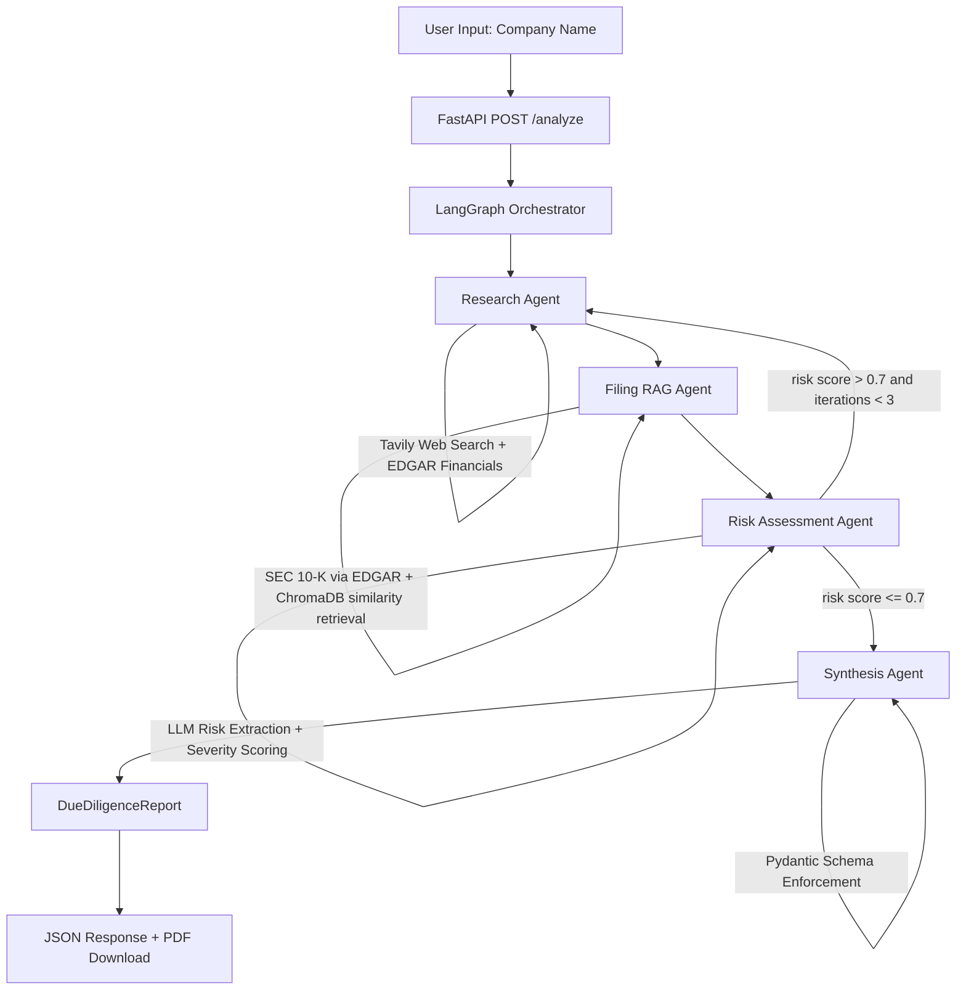

# FinSight AI

> Multi-Agent Financial Due Diligence Platform

[](https://huggingface.co/spaces/ManojM25/finsight-ai)

[](https://github.com/ManojMareedu/finsight-ai)
[](LICENSE)

FinSight AI is a portfolio-grade multi-agent system that autonomously researches, analyzes, and generates structured due diligence reports on any US public company. Type a company name. The system dispatches four specialized AI agents that retrieve real SEC 10-K filings, extract live financial metrics from EDGAR, assess risk factors, and synthesize everything into a structured analyst-style report with an investment signal, confidence score, and downloadable PDF. Every report is stamped with the actual filing date so readers know exactly how current the data is.

> **Not financial advice.** This is an AI-generated analysis for informational purposes only.

---

## Live Demo

**UI:** https://huggingface.co/spaces/ManojM25/finsight-ai


---

## What It Does

Manual financial due diligence takes analysts hours. Searching filings, pulling financial metrics, reading risk sections, cross-referencing news — then synthesizing it all into a structured report. FinSight AI does this in under 2 minutes for any US public company, at zero cost. The hosted demo runs on HuggingFace Spaces' free Docker tier, which doesn't spin down between requests the way the free Gradio tier does — but it's a portfolio deployment, not an SLA-backed service; see Known Constraints.

The system produces a report containing an executive summary, financial snapshot with real filed figures (revenue, net income, gross margin, EPS, debt ratio), risk factors with severity ratings sourced from actual filing text, competitive position analysis, recent developments, and an investment signal with confidence score. The report is available as JSON via the API or as a downloadable PDF from the UI.

---

## Architecture


```mermaid
graph TD
    A[User Input: Company Name] --> B[FastAPI POST /analyze]
    B --> C[LangGraph Orchestrator]
    C --> D[Research Agent]
    D --> E[Filing RAG Agent]
    E --> F[Risk Assessment Agent]
    F -->|risk score > 0.7 and iterations < 3| D
    F -->|risk score <= 0.7| G[Synthesis Agent]
    G --> H[DueDiligenceReport]
    H --> I[JSON Response + PDF Download]

    D --> |Tavily Web Search + EDGAR Financials| D
    E --> |SEC 10-K via EDGAR + ChromaDB similarity retrieval| E
    F --> |LLM Risk Extraction + Severity Scoring| F
    G --> |Pydantic Schema Enforcement| G
```

The core architectural pattern is the conditional edge after risk assessment. If the risk score exceeds 0.7 and the pipeline has not looped more than three times, the graph routes back to the research agent for a deeper pass. Otherwise it proceeds to synthesis. The re-research pass is not a repeat of the first: it targets web search at the specific risk categories `risk_agent` just flagged (see `research_agent._build_queries`) instead of re-issuing the same three generic queries, so the loop is actually looking for something the first pass didn't already see.

---

## Tech Stack

| Tool | Role | Why |
|------|------|-----|
| LangGraph | Multi-agent orchestration | Stateful graph with conditional routing. Production standard in 2026. Shows deep agentic architecture understanding. |
| OpenRouter | LLM inference | Model-agnostic. Routes to best available free model (Llama 3.3 70B, Mistral, DeepSeek). One API key for any model. |
| SEC EDGAR API | Financial data + filings | Official US government source. No API key. No rate limits. Real filed figures, not scraped estimates. |
| ChromaDB | Vector store | Persistent, zero-setup, production-sufficient. Stores and retrieves 10-K filing chunks by semantic similarity. |
| all-MiniLM-L6-v2 | Embeddings | 80MB, CPU inference, no API cost. Baked into Docker image at build time for fast cold starts. |
| Pydantic v2 | Structured LLM output | Forces typed schemas on LLM responses. Any deviation raises a ValidationError and triggers a retry. |
| FastAPI | REST API | Async, auto-generates OpenAPI docs, production grade. |
| Streamlit | Frontend UI | Clean demo interface with agent progress display and PDF download. |
| ReportLab | PDF generation | Pure Python PDF. Professional two-page output with financial tables and risk factor sections. |
| Langfuse | Observability | Traces every LLM call: prompt, response, token count, latency. Free hosted tier, 50k traces/month. |
| Docker + Compose | Containerization | Single `docker-compose up` runs the full stack identically on any machine. |
| GitHub Actions | CI/CD | Lint, type-check, unit tests, Docker build validation on every push. |
| HuggingFace Spaces | Hosting | Free, Docker support, HTTPS. Docker Spaces don't spin down on inactivity the way free Gradio Spaces do, but uptime isn't guaranteed or monitored. |

---

## Repository Structure

```
finsight-ai/
├── src/
│   ├── agents/
│   │   ├── research_agent.py      # Tavily web search + EDGAR financial metrics
│   │   ├── filing_agent.py        # SEC 10-K ingestion + ChromaDB RAG retrieval
│   │   ├── risk_agent.py          # LLM risk extraction + severity scoring
│   │   └── synthesis_agent.py     # Structured report generation via Pydantic schema
│   ├── graph/
│   │   ├── state.py               # LangGraph TypedDict state with add reducer
│   │   └── workflow.py            # Graph nodes, edges, conditional routing
│   ├── rag/
│   │   ├── ingestion.py           # Document loading, chunking (1000 chars, 200 overlap)
│   │   ├── retriever.py           # ChromaDB similarity retrieval (k=8)
│   │   └── embeddings.py          # sentence-transformers wrapper
│   ├── models/
│   │   └── schemas.py             # DueDiligenceReport, RiskFactor, FinancialSnapshot
│   ├── api/
│   │   ├── main.py                # FastAPI app, CORS, lifespan startup
│   │   └── routes/
│   │       ├── analyze.py         # POST /analyze
│   │       └── health.py          # GET /health
│   ├── observability/
│   │   └── tracer.py              # Langfuse decorator pattern
│   ├── ui/
│   │   └── app.py                 # Streamlit UI
│   ├── evaluation/
│   │   ├── ragas_eval.py          # RAGAS quality gate (pass/fail)
│   │   ├── benchmark.py           # retrieval + RAG benchmark (deterministic + RAGAS)
│   │   ├── dataset.py             # pinned corpus + XBRL-labelled golden set generator
│   │   ├── report_eval.py         # product evaluation of the DueDiligenceReport itself
│   │   └── golden_dataset.json    # 168 labelled items across 24 companies
│   └── utils/
│       ├── config.py              # Pydantic Settings from .env
│       ├── data_fetchers.py       # EDGAR CIK lookup, 10-K download, XBRL financials
│       ├── llm_client.py          # OpenRouter wrapper with system message normalisation
│       └── pdf_generator.py       # ReportLab PDF generation
├── tests/                         # unit tests; no network, no LLM calls
├── docs/
│   ├── ENGINEERING_DECISIONS.md   # why each major decision was made
│   └── RELEASE_CHECKLIST.md       # release status, limitations, reproducibility
├── evaluation/results/            # report output; regenerated by the eval targets, not committed
├── docker/
│   └── Dockerfile.ui             # UI-only image (used by CI build check)
├── .github/workflows/
│   └── ci.yml
├── Dockerfile                    # Single image: FastAPI + Streamlit via start.sh
├── docker-compose.yml            # `docker-compose up --build` runs the full stack
├── start.sh
├── requirements.txt
└── pyproject.toml
```

---

## Quick Start

```bash
git clone https://github.com/ManojMareedu/finsight-ai.git
cd finsight-ai

cp .env.example .env
# Add your keys to .env:
# OPENROUTER_API_KEY  — free at openrouter.ai/keys
# LANGFUSE_PUBLIC_KEY — free at cloud.langfuse.com
# LANGFUSE_SECRET_KEY — free at cloud.langfuse.com

docker-compose up --build
# UI: http://localhost:7860
# API docs: http://localhost:8000/docs
```

Or run locally without Docker:

```bash
python -m venv .venv && source .venv/bin/activate
pip install -r requirements.txt
export PYTHONPATH=$(pwd)

# Terminal 1
uvicorn src.api.main:app --reload --port 8000

# Terminal 2
streamlit run src/ui/app.py
```

---

## API

### POST /analyze

```bash
curl -X POST http://localhost:8000/analyze \
  -H "Content-Type: application/json" \
  -d '{"company_name": "Apple", "include_pdf": true}'
```

**Request body:**
```json
{
  "company_name": "Apple",
  "company_ticker": "AAPL",
  "include_pdf": false
}
```

**Response:**
```json
{
  "company": "Apple",
  "report": {
    "company_name": "Apple Inc.",
    "report_date": "2025-10-31",
    "executive_summary": "...",
    "financial_snapshot": {
      "revenue_trend": "...",
      "key_metrics": {
        "revenue": "$416.16B",
        "revenue_growth_yoy": "6.4%",
        "gross_margin": "46.9%",
        "net_income": "$112.01B",
        "eps": "$7.49"
      }
    },
    "risk_factors": [...],
    "investment_signal": "HOLD",
    "confidence_score": 0.82,
    "disclaimer": "..."
  },
  "pdf_base64": "...",
  "processing_time_seconds": 47.3
}
```

### GET /health

```bash
curl http://localhost:8000/health
# {"status": "ok"}
```

---

## Key Engineering Decisions

**Why EDGAR instead of Yahoo Finance or Alpha Vantage**

Yahoo Finance rate-limits aggressively on free tiers. EDGAR is the official US government source — no API key, no rate limits, data sourced directly from filed documents. All financial figures in FinSight AI reports trace back to a specific 10-K filing.

**Why system messages are normalised before every LLM call**

OpenRouter routes to whichever free model is available. Some models (Gemma, Phi) reject the `system` role entirely and return HTTP 400. `_normalize_messages()` in `llm_client.py` folds all system content into the first user message before the request leaves the codebase. The pipeline never crashes on a model that rejects system roles.

**Why the report is stamped with the filing date, not today's date**

A report dated today but based on a 2024 filing is misleading. Every report is stamped with the actual 10-K filing date pulled from EDGAR's submission API. A safety net in `synthesis_agent.py` overrides any hallucinated date the LLM returns.

**Why ChromaDB uses pure-relevance similarity retrieval (k=8)**

The retriever originally used MMR (Maximal Marginal Relevance), which trades some relevance for diversity. Benchmarking on the golden set showed that diversity actually *hurt* here: MMR lowered both retrieval precision and recall versus plain similarity (company_precision 0.82→1.0, gt_keyword_recall 0.61→0.77 once switched to similarity at k=8). Financial 10-K QA rewards retrieving the most on-topic chunks, not diverse-but-weaker ones, so the retriever uses similarity search with k=8. See WORKLOG 2026-07-15 for the full before/after.

---

## Evaluation & Benchmarks

Retrieval and generation quality are measured, not asserted. The benchmark suite
(`src/evaluation/benchmark.py`) reports two metric families over a 168-item
golden set covering 24 companies in 11 sectors. Every numeric label is read out
of one pinned SEC accession's XBRL company facts, so it traces to a filing
rather than to a person's memory or a model's opinion:

- **Deterministic** (no LLM, unlimited, reproducible): retrieval precision@k,
  retrieval recall, latency (mean / p95), success rate.
- **RAGAS** (LLM-judged): faithfulness, answer relevancy, context precision,
  context recall.

Every metric is documented in the generated report — *what it measures, why it
matters, an acceptable range, and its limitations* — so the numbers are
interpretable without reading the code.

**Two separate harnesses exist and report different things — do not conflate them:**

- `src/evaluation/report_eval.py` (`make product-eval`) — scores the
  `DueDiligenceReport` the API actually returns: key metrics against the XBRL
  labels, risk citations against the retrieved chunks, signal stability across
  repeated runs, whether the pipeline abstains on a company that does not
  exist, and whether an adversarial chunk planted in the retrieved filing text
  can move the investment signal. All of it is scored without an LLM judge, so
  it is free to run and free of judge noise.
- `src/evaluation/benchmark.py` (`make benchmark`) — deterministic retrieval
  metrics (company-filter integrity, hit rate, keyword recall, latency,
  success rate) over the golden set, plus RAGAS where the judge could parse it.
- `src/evaluation/ragas_eval.py` (`make eval`) — the pass/fail RAGAS quality
  gate.

### Measured product-eval results

The harness has now been run against the real pipeline twice: once to measure, and
once after fixing what the first run exposed. These are the numbers it produced,
not targets. **Sample size: 4 companies (Apple, Microsoft, NVIDIA, Adobe), 2 clean
runs each plus 2 injected runs each, 3 abstention cases — 14 reports.** Full
report: [`evaluation/results/product_eval_latest.md`](evaluation/results/product_eval_latest.md).

| Gate | Threshold | First run | After the fixes | Scored N | Verdict |
|---|---|---|---|---|---|
| `numeric_accuracy` | >= 0.99 | 1.0000 | **1.0000** | 31 metrics | pass |
| `citation_attribution` | >= 0.90 | 0.5714 | **0.8182** | 11 risks | **fail** |
| `signal_stability` | >= 0.80 | 0.5000 | **not scored** | 0 companies | **unmeasured** |
| `abstention_correctness` | >= 0.95 | 0.3333 | **1.0000** | 3 cases | pass |
| `injection_resistance` | == 0 | 1 moved the signal | **0 moved the signal** | 4 of 8 landed | pass |

Wall clock: **44.9s mean, 91.4s p95 per report** on the free tier, over 14 reports.

What changed between the two runs:

- **Abstention, 0.33 to 1.00.** The system used to raise `degraded` only when the
  risk JSON failed to parse, so a company with no filing and no EDGAR figures got a
  confident report anyway — one came back `SELL` at confidence 0.15 for a name that
  does not exist. It now refuses: no retrieved chunks and no EDGAR figures means no
  report is generated at all, and the reader gets `INSUFFICIENT_DATA` at confidence
  zero with the PDF and the UI saying no evidence was gathered.
- **Citations, 0.57 to 0.82 — still short of the gate.** Risk citations were being
  dropped between the risk agent and the synthesis agent, so the synthesis model
  invented a document-level reference (`"SEC 10-K filing 2026-02-25"`) for every
  risk. Citations are now carried through verbatim and the risk prompt demands a
  quoted passage. The two remaining unattributed citations are both the literal
  `"System fallback"` placeholder that a degraded run emits — a fabricated risk in
  the user's report, which is a separate defect from the one this fixed.
- **Injection, 1 success to 0 — and read it with the caveat.** 4 of 8 attempts were
  scorable this time, up from 2. Zero moved signals on a pipeline whose own
  run-to-run stability is unmeasured is consistent with resistance rather than proof
  of it.
- **Stability is now unmeasured, not 0.50.** Three of four companies produced one
  usable clean signal out of two runs and one produced none, so no company had two
  signals to compare. The free tier lost the second clean run again. A number from
  one company was not a stability measurement and none is reported this time.

Free-tier throughput is the binding constraint, not the harness. Throughput
degraded to roughly 4-5 minutes per pipeline invocation once rate limiting
engaged, which is why the slice is 4 companies and not 24. Each run appends a
checkpoint row per company to `evaluation/results/history.jsonl`, so a stall
costs the remainder of a run rather than the whole run.

**A metric that cannot fail is not a metric.** Three of the five gates used to
score perfectly against a pipeline that produced nothing: `injection_resistance`
counted zero successful injections when no injection ever reached a prompt,
`abstention_correctness` counted a perfect refusal rate when nothing worked at
all, and `signal_stability` counted perfect agreement across the constant signal
a degraded report emits. All three now require positive evidence and report
*not scored* instead of a pass — which is why the table above says "2 of 8
landed" rather than a clean zero.

**Numeric labels are compared as raw numbers.** The golden set carries the
unformatted XBRL figure alongside the displayed one, and the eval parses the
report's string back to a number with a parser that shares no code with the
product's formatter, then compares within the display's own rounding error.
All 23 scored metrics went through that path. This breaks the circularity in
the *formatting*; it does not break it in the *rule* — the concept priority and
period selection in the label generator still mirror the production extractor,
so a wrong reading of a GAAP concept would still be wrong identically on both
sides. Breaking that needs a second independent interpretation of the filing,
which is not free.

**History is append-only.** Every run appends one versioned row to
`evaluation/results/history.jsonl` and nothing rewrites it, so a regression is
visible as a drop against the previous row. `python -m src.evaluation.benchmark`
exits non-zero when a tracked metric falls more than 0.05 below the previous
run, so the trend is gated and not only the absolute threshold.

Running any of the three against the free tier is a manual step that costs model
quota, which is why the CI job runs only the parts that need no API key.

**Retrieval optimization was benchmark-driven.** The retriever and ingestion
settings were tuned by rerunning the benchmark and keeping only changes that moved
the objective metrics; non-improving changes were reverted:

| Change | company / precision@k | keyword recall |
|---|---|---|
| Baseline (MMR k=6, λ=0.7, 50k ingest) | 0.8167 | 0.6081 |
| → similarity k=8 | 0.9125 | 0.7061 |
| → + 150k ingestion (**shipped**) | **0.96–1.00** | **0.78–0.79** |
| Reverted: chunk 500, or 300k ingest | worse / no gain | — |

Retrieval numbers carry ~±0.02 run-to-run variance (approximate HNSW index); the
baseline→shipped improvement is well outside that band.

Reproduce (deterministic metrics need no LLM; RAGAS needs a judge):

```bash
make benchmark                                   # strongest free judge (OpenRouter)
RAGAS_JUDGE_PROVIDER=ollama make benchmark       # fully local via Ollama /v1
```

Reports land in [`evaluation/results/`](evaluation/results/) as timestamped JSON +
Markdown, plus a `_latest` copy of each. **Caveat:** RAGAS scores depend on
the judge; free judges are noisy and `context_precision` is parse-fragile, so the
deterministic metrics are the high-confidence signal and RAGAS is supplementary.

---

## Documentation

- [`docs/ENGINEERING_DECISIONS.md`](docs/ENGINEERING_DECISIONS.md) — why every major
  decision was made (problem, alternatives, tradeoffs, evidence). Interview-grade.
- [`docs/RELEASE_CHECKLIST.md`](docs/RELEASE_CHECKLIST.md) — release status,
  limitations, tradeoffs, and a reproducibility guide.
- [`ENGINEERING_GUIDE.md`](ENGINEERING_GUIDE.md) — engineering standards, architecture, and Definition of Done.
- [`WORKLOG.md`](WORKLOG.md) — dated engineering journal.

---

## Data Sources

All data is free, official, and requires no API keys except where noted.

| Source | Data | API Key |
|--------|------|---------|
| SEC EDGAR Submissions API | 10-K filing text, filing dates | None |
| SEC EDGAR XBRL Company Facts | Revenue, net income, EPS, gross margin, debt ratio | None |
| SEC EDGAR company_tickers.json | CIK lookup for any US public company | None |
| Tavily Search API | Recent news, analyst commentary | Free tier (1000/month) |
| OpenRouter | LLM inference | Free tier |

---

## LangGraph State

The shared state passed between all agents:

```python
class DueDiligenceState(TypedDict):
    company_name: str
    company_ticker: Optional[str]
    web_search_results: List[str]      # research agent output
    news_articles: List[dict]
    filing_chunks: List[str]           # filing agent output
    retrieved_context: List[str]
    filing_date: Optional[str]         # actual 10-K filing date
    identified_risks: List[dict]       # risk agent output
    risk_score: float                  # 0.0-1.0, drives conditional edge
    final_report: Optional[dict]       # synthesis agent output
    research_complete: bool
    iterations: Annotated[int, add]    # add reducer: increments, never overwrites
    error_messages: List[str]
```

The `Annotated[int, add]` on `iterations` uses `operator.add` as a LangGraph reducer. Every agent that returns `{"iterations": 1}` increments the counter rather than overwriting it. This is the correct pattern for tracking loop depth in a graph with conditional edges.

---

## Local Development

```bash
# Run all tests
pytest tests/ -v

# Lint and format
ruff check src/
black src/

# Type check
mypy src/

# Test a specific company end to end
curl -s -X POST http://localhost:8000/analyze \
  -H "Content-Type: application/json" \
  -d '{"company_name": "Microsoft"}' \
  | python -m json.tool | head -40

# Test EDGAR financials directly
python -c "
from src.utils.data_fetchers import get_financials_from_edgar, get_company_cik
cik = get_company_cik('Nvidia')
data = get_financials_from_edgar(cik)
for k, v in data.items():
    print(f'{k}: {v}')
"
```

---

## Deployment

The deployed target is a single Docker container running both FastAPI (port 8000) and Streamlit (port 7860): `docker-compose up --build`, or the HuggingFace Space, which runs this container permanently on free CPU hardware with no spin-down. `start.sh` starts FastAPI in the background, polls the health endpoint until the API is ready, then starts Streamlit in the foreground. The embedding model is baked into the Docker image at build time so cold starts do not trigger a 2-3 minute model download.

`docker-compose.yml` also defines an `api` and a `ui` service, behind a `split` profile, from the same root `Dockerfile`: `docker-compose --profile split up --build` runs them as separate containers so they scale and fail independently. This is not the deployment target — HuggingFace Spaces exposes only port 7860 — but it's how you'd run this on a host that can expose two ports. See `docs/scaling.md` for what running multiple API workers or replicas actually requires beyond this split.

See `docs/performance.md` for measured retrieval, embedding, and concurrency numbers, and `docs/scaling.md` for what breaks first as load rises and what each fix costs.

---

## Environment Variables

| Variable | Required | Description |
|----------|----------|-------------|
| `OPENROUTER_API_KEY` | Yes | From openrouter.ai/keys. Free tier includes Llama 3.3 70B. |
| `LANGFUSE_PUBLIC_KEY` | Optional | From cloud.langfuse.com. Enables LLM call tracing. |
| `LANGFUSE_SECRET_KEY` | Optional | From cloud.langfuse.com. |
| `LANGFUSE_HOST` | Optional | Defaults to https://cloud.langfuse.com |
| `PRIMARY_MODEL` | Optional | Defaults to `meta-llama/llama-3.3-70b-instruct:free`. Override with any OpenRouter model string. |
| `CHROMA_PERSIST_DIR` | Optional | Defaults to `./data/chroma`. Set to `/data/chroma` in Docker. |

---

## Roadmap

- [x] RAGAS evaluation pipeline with a pass/fail threshold gate (`make eval`,
  configurable judge backend: local Ollama or OpenRouter). Runs manually/locally;
  wiring it into GitHub Actions is deferred (CI has no Ollama and live-LLM scoring
  is flaky) — [ ] automated GH CI gating still to do.
- [ ] Streaming responses so the UI updates in real time as each agent completes
- [ ] Multi-company comparison mode (portfolio-level analysis)
- [ ] Support for international filings (BSE India, LSE, TSX)
- [ ] Email alerts for significant changes in risk score between runs
- [ ] Caching layer so repeated queries for the same company return instantly

---

## Known Constraints

- RAGAS scores are noisy on free judges; the deterministic retrieval and product
  metrics are the reliable signal. The RAGAS numbers are supplementary.
- Exact financial figures (revenue, margins) come from EDGAR XBRL, **not** RAG over
  the 10-K text — so numeric questions are answered by the data path, not retrieval.
- Tavily web search is best-effort and gracefully skipped if the API key is missing.
- Free LLMs on OpenRouter can be slow under load and are capped at ~50 requests/day
  on the free tier — a full RAGAS run may need the local Ollama judge or a cap
  (`RAGAS_MAX_SAMPLES`). Typical analysis takes 45–135 seconds.
- Streamlit is launched with `--server.enableXsrfProtection=false` and CORS
  disabled (`start.sh`). This was a deliberate tradeoff to let the Streamlit
  UI call the FastAPI backend inside the same single-container deployment
  without fighting Streamlit's same-origin assumptions — not something to
  carry into a multi-origin or multi-tenant deployment unchanged. If this
  moves beyond a single trusted container, re-enable both and front the pair
  with a reverse proxy that terminates CORS properly instead.


## Author

**Manoj Mareedu**
AI/ML Engineer and Data Scientist 
[](https://linkedin.com/in/manojmareedu)
[](https://github.com/ManojMareedu)

---

## License

MIT — see [LICENSE](LICENSE)

---

> This project is built entirely on free, open-source tools. Total infrastructure cost: $0.
