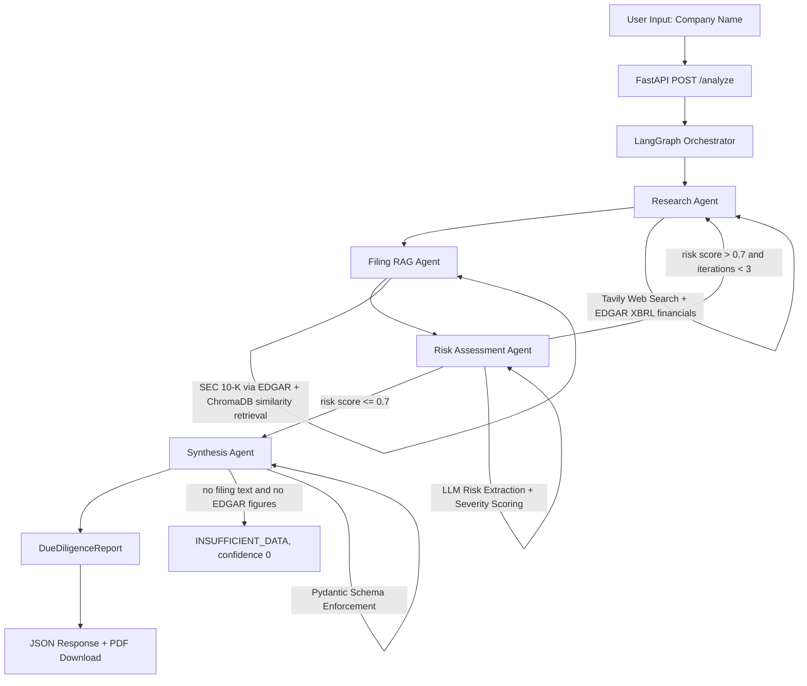

# FinSight AI

> Multi-Agent Financial Due Diligence Platform

[](https://huggingface.co/spaces/ManojM25/finsight-ai)

[](https://github.com/ManojMareedu/finsight-ai)
[](LICENSE)

FinSight AI is a portfolio-grade multi-agent system that autonomously researches, analyzes, and generates structured due diligence reports on any US public company. Type a company name. The system dispatches four specialized AI agents that retrieve real SEC 10-K filings, pull live financial metrics from EDGAR's XBRL company facts, assess risk factors, and synthesize everything into a structured analyst-style report with an investment signal, confidence score, and downloadable PDF.

Two properties are worth calling out up front, because they are what the engineering work went into:

- **Every financial figure is authoritative SEC data, not model output.** The XBRL values travel through graph state and overwrite the model's transcription after validation, so no number in a report depends on an LLM copying it correctly.
- **The system refuses rather than guesses.** If no filing text and no EDGAR figures could be gathered, no report is generated: the reader gets `INSUFFICIENT_DATA` at confidence zero instead of a confident-looking analysis of nothing.

Every report is stamped with the actual 10-K filing date, so readers know exactly how current the data is.

> **Not financial advice.** This is an AI-generated analysis for informational purposes only.

---

## Live Demo

**UI:** https://huggingface.co/spaces/ManojM25/finsight-ai

---

## What It Does

Manual financial due diligence takes analysts hours. Searching filings, pulling financial metrics, reading risk sections, cross-referencing news — then synthesizing it all into a structured report. FinSight AI does this in roughly 45–135 seconds for any US public company, at zero cost. The hosted demo runs on HuggingFace Spaces' free Docker tier. It is a portfolio deployment, not an SLA-backed service; see Known Constraints.

The system produces a report containing an executive summary, financial snapshot with real filed figures (revenue, revenue growth, net income, gross margin, EPS, debt ratio), risk factors with severity ratings and quoted citations from actual filing text, competitive position analysis, recent developments, and an investment signal with a confidence score derived from measurable signals rather than self-reported by the model. The report is available as JSON via the API or as a downloadable PDF from the UI.

---

## Architecture


```mermaid
graph TD
    A[User Input: Company Name] --> B[FastAPI POST /analyze]
    B --> C[LangGraph Orchestrator]
    C --> D[Research Agent]
    D --> E[Filing RAG Agent]
    E --> F[Risk Assessment Agent]
    F -->|risk score > 0.7 and iterations < 3| D
    F -->|risk score <= 0.7| G[Synthesis Agent]
    G --> H[DueDiligenceReport]
    G -->|no filing text and no EDGAR figures| Z[INSUFFICIENT_DATA, confidence 0]
    H --> I[JSON Response + PDF Download]

    D --> |Tavily Web Search + EDGAR XBRL financials| D
    E --> |SEC 10-K via EDGAR + ChromaDB similarity retrieval| E
    F --> |LLM Risk Extraction + Severity Scoring| F
    G --> |Pydantic Schema Enforcement| G
```

The core architectural pattern is the conditional edge after risk assessment. If the risk score exceeds 0.7 and the pipeline has not looped more than three times, the graph routes back to the research agent for a deeper pass. Otherwise it proceeds to synthesis. The re-research pass is not a repeat of the first: it targets web search at the specific risk categories `risk_agent` just flagged (see `research_agent._build_queries`) instead of re-issuing the same three generic queries, so the loop is actually looking for something the first pass didn't already see.

The second pattern is the abstention path. Synthesis checks for evidence *before* it asks a model to reason about it — no retrieved chunks and no EDGAR figures means the LLM is never called, and the report is constructed directly as `INSUFFICIENT_DATA`.

---

## Tech Stack

| Tool | Role | Why |
|------|------|-----|
| LangGraph | Multi-agent orchestration | Stateful graph with conditional routing. Production standard in 2026. Shows deep agentic architecture understanding. |
| OpenRouter | LLM inference | Model-agnostic. One API key for any model. Pinned to a concrete free slug (`meta-llama/llama-3.3-70b-instruct:free`) rather than `openrouter/auto`, so the default can never route to a paid model; swap it with `PRIMARY_MODEL`. |
| SEC EDGAR API | Financial data + filings | Official US government source. No API key. Real filed figures, not scraped estimates. |
| ChromaDB | Vector store | Persistent, zero-setup, production-sufficient. Stores and retrieves 10-K filing chunks by semantic similarity, with document ids keyed on CIK. |
| all-MiniLM-L6-v2 | Embeddings | 80MB, CPU inference, no API cost. Baked into Docker image at build time for fast cold starts. |
| Pydantic v2 | Structured LLM output | Forces typed schemas on LLM responses. Any deviation raises a ValidationError and triggers a retry. |
| FastAPI | REST API | Async, auto-generates OpenAPI docs, production grade. |
| Streamlit | Frontend UI | Clean demo interface with agent progress display and PDF download. |
| ReportLab | PDF generation | Pure Python PDF. Professional two-page output with financial tables and risk factor sections. |
| Langfuse | Observability | Traces every LLM call: prompt, response, token count, latency. Free hosted tier. |
| Docker + Compose | Containerization | Single `docker-compose up` runs the full stack identically on any machine. |
| GitHub Actions | CI/CD | Lint, type-check, 156 unit tests on pushes to `main` and every PR; Docker build on pushes to `main`; a scheduled evaluation gate. |
| HuggingFace Spaces | Hosting | Free, Docker support, HTTPS. Uptime is neither guaranteed nor monitored — this is a portfolio deployment. |

---

## Repository Structure

```
finsight-ai/
├── src/
│   ├── agents/
│   │   ├── research_agent.py      # Tavily web search + EDGAR XBRL financial metrics
│   │   ├── filing_agent.py        # SEC 10-K ingestion + ChromaDB RAG retrieval
│   │   ├── risk_agent.py          # LLM risk extraction + severity scoring
│   │   └── synthesis_agent.py     # Structured report, abstention, derived confidence
│   ├── graph/
│   │   ├── state.py               # LangGraph TypedDict state with add reducer
│   │   └── workflow.py            # Graph nodes, edges, conditional routing
│   ├── rag/
│   │   ├── chroma_client.py       # One PersistentClient per process
│   │   ├── ingestion.py           # Document loading, chunking (1000 chars, 200 overlap)
│   │   ├── retriever.py           # ChromaDB similarity retrieval (k=8)
│   │   └── embeddings.py          # sentence-transformers wrapper
│   ├── models/
│   │   └── schemas.py             # DueDiligenceReport, RiskFactor, FinancialSnapshot
│   ├── api/
│   │   ├── main.py                # FastAPI app, request-id middleware, startup warmup
│   │   └── routes/
│   │       ├── analyze.py         # POST /analyze, background jobs, auth, rate limit, cache
│   │       └── health.py          # GET /health, GET /ready
│   ├── observability/
│   │   ├── tracer.py              # Cached Langfuse client
│   │   ├── logging.py             # Structured JSON logging + request-id context
│   │   └── llm_metering.py        # Per-call model + token accounting
│   ├── ui/
│   │   └── app.py                 # Streamlit UI
│   ├── evaluation/
│   │   ├── report_eval.py         # product evaluation of the DueDiligenceReport itself
│   │   ├── benchmark.py           # retrieval + RAG benchmark (deterministic + RAGAS)
│   │   ├── ragas_eval.py          # RAGAS quality gate (pass/fail)
│   │   ├── dataset.py             # pinned corpus + XBRL-labelled golden set generator
│   │   ├── golden_dataset.json    # 168 labelled items across 24 companies
│   │   ├── manual_items.json      # hand-written items the generator cannot derive
│   │   └── snapshot.json          # pinned accession numbers the labels are read from
│   └── utils/
│       ├── config.py              # Pydantic Settings from .env
│       ├── data_fetchers.py       # EDGAR CIK lookup, 10-K download, XBRL financials
│       ├── llm_client.py          # OpenRouter wrapper with system message normalisation
│       ├── retry.py               # Bounded retry with exponential backoff + jitter
│       └── pdf_generator.py       # ReportLab PDF generation (free text XML-escaped)
├── tests/                         # 156 unit tests; no network, no LLM calls
├── benchmarks/
│   └── measure.py                 # local retrieval/embedding/concurrency measurement
├── docs/
│   ├── ENGINEERING_DECISIONS.md   # why each major decision was made
│   ├── RELEASE_CHECKLIST.md       # release status, limitations, reproducibility
│   ├── performance.md             # measured retrieval, embedding, concurrency numbers
│   └── scaling.md                 # what breaks first under load, and what each fix costs
├── evaluation/results/            # committed product-eval `_latest` + history.jsonl;
│                                  # timestamped runs gitignored
├── .github/workflows/
│   ├── ci.yml                     # lint, mypy, tests, Docker build on main
│   └── eval.yml                   # scheduled product-evaluation gate
├── ENGINEERING_GUIDE.md           # engineering standards and Definition of Done
├── WORKLOG.md                     # dated engineering journal
├── TODO.md                        # tracked follow-ups
├── Makefile                       # the make targets under Local Development
├── Dockerfile                     # Single image: FastAPI + Streamlit via start.sh
├── docker-compose.yml             # default single container; `split` profile for two
├── start.sh
├── .env.example
├── .dockerignore
├── requirements.txt
├── pyproject.toml
└── LICENSE
```

---

## Quick Start

```bash
git clone https://github.com/ManojMareedu/finsight-ai.git
cd finsight-ai

cp .env.example .env
# Add your keys to .env:
# OPENROUTER_API_KEY  — free at openrouter.ai/keys
# TAVILY_API_KEY      — optional, free at tavily.com (web search is skipped without it)
# LANGFUSE_PUBLIC_KEY — optional, free at cloud.langfuse.com
# LANGFUSE_SECRET_KEY — optional, free at cloud.langfuse.com

docker-compose up --build
# UI: http://localhost:7860
# API docs: http://localhost:8000/docs
```

Or run locally without Docker:

```bash
python -m venv .venv && source .venv/bin/activate
pip install -r requirements.txt
export PYTHONPATH=$(pwd)

# Terminal 1
uvicorn src.api.main:app --reload --port 8000

# Terminal 2
streamlit run src/ui/app.py
```

---

## API

Interactive docs at `http://localhost:8000/docs`.

**Authentication.** Set `FINSIGHT_API_KEY` and every `/analyze*` endpoint requires an
`X-API-Key` header. If it is unset, auth is disabled and the API logs a warning at
startup — a deliberate fail-open, because in the deployed Space only port 7860
(Streamlit) is published and the API is container-internal. Set the key the moment
the API is exposed directly.

**Rate limiting.** 10 requests per IP per 60 seconds on the submit endpoints,
returning `429` with a `Retry-After` header.

**Caching.** Reports are cached per company and keyed on the 10-K filing date, not on
wall-clock TTL — a cache hit re-checks EDGAR for a newer filing (no LLM call) before
serving.

### POST /analyze

Blocks until the pipeline finishes (roughly 45–135s). The blocking work runs on a
worker thread, so it does not hold up the event loop.

```bash
curl -X POST http://localhost:8000/analyze \
  -H "Content-Type: application/json" \
  -H "X-API-Key: $FINSIGHT_API_KEY" \
  -d '{"company_name": "Apple", "include_pdf": true}'
```

**Request body:**
```json
{
  "company_name": "Apple",
  "company_ticker": "AAPL",
  "include_pdf": false
}
```

**Response:**
```json
{
  "company": "Apple",
  "report": {
    "company_name": "Apple Inc.",
    "report_date": "2025-10-31",
    "executive_summary": "...",
    "financial_snapshot": {
      "revenue_trend": "...",
      "key_metrics": {
        "revenue": "$416.16B",
        "revenue_growth_yoy": "6.4%",
        "gross_margin": "46.9%",
        "net_income": "$112.01B",
        "eps": "$7.49"
      }
    },
    "risk_factors": [...],
    "investment_signal": "HOLD",
    "confidence_score": 0.82,
    "disclaimer": "..."
  },
  "pdf_base64": "...",
  "processing_time_seconds": 47.3
}
```

A company that cannot be resolved returns `422`. A company that resolves but yields no
filing text and no EDGAR figures returns a report with
`"investment_signal": "INSUFFICIENT_DATA"` and `"confidence_score": 0.0` — consumers
must render that differently from `HOLD`.

### POST /analyze/jobs — submit and poll

For clients that cannot hold a connection open for two minutes.

```bash
curl -X POST http://localhost:8000/analyze/jobs \
  -H "Content-Type: application/json" \
  -H "X-API-Key: $FINSIGHT_API_KEY" \
  -d '{"company_name": "Microsoft"}'
# {"job_id": "<256-bit url-safe token>", "status": "pending"}
```

### GET /analyze/jobs/{job_id}

```bash
curl http://localhost:8000/analyze/jobs/<job_id> -H "X-API-Key: $FINSIGHT_API_KEY"
# {"job_id": "...", "status": "pending" | "done" | "error", "report": {...}}
```

Job ids are 256 bits from `secrets.token_urlsafe`. There are no user accounts, so when
`FINSIGHT_API_KEY` is unset the id itself is the entire capability — the same trust
model as a bearer token. The store holds at most 1000 jobs and sheds further submissions
with `503` rather than growing without bound. A finished job stays retrievable until the
process restarts: a one-hour TTL exists, but its sweep only runs *above* the cap that the
submit path already refuses to cross, so today it never fires. Tracked in the roadmap.

### GET /health and GET /ready

```bash
curl http://localhost:8000/health   # opens Chroma + loads the embedding model
curl http://localhost:8000/ready    # the above, plus LLM provider config is present
# {"status": "ok"}   — 503 with a detail string on failure
```

Both probes check something real, and neither ever makes a billable LLM call —
`/ready` verifies key presence only.

---

## Key Engineering Decisions

**Why financial figures never pass through the LLM**

EDGAR XBRL figures were originally fetched correctly, flattened into a prompt string,
and re-extracted by the model — which meant no number in a report was verifiable. The
structured values now travel through graph state (`financial_metrics`) and overwrite
the model's transcription after validation. Revenue growth additionally requires
same-concept, adjacent periods within a plausibility bound, so a concept switch between
filings can't silently produce a nonsense growth rate.

**Why EDGAR instead of Yahoo Finance or Alpha Vantage**

Yahoo Finance rate-limits aggressively on free tiers. EDGAR is the official US
government source — no API key, data sourced directly from filed documents. All
financial figures in FinSight AI reports trace back to a specific 10-K filing.

**Why the system abstains instead of degrading quietly**

The pipeline used to raise `degraded` only when the risk JSON failed to parse, so a
company with no filing and no EDGAR figures still got a confident report — one came
back `SELL` at confidence 0.15 for a name that does not exist. Absence of evidence is
now checked before the LLM is asked to reason about it, and the answer is
`INSUFFICIENT_DATA` at confidence zero, said plainly in the API response, the PDF, and
the UI.

**Why confidence is computed, not self-reported**

A model asked to rate its own confidence produces a number that correlates with tone,
not evidence. `_compute_confidence` derives it from measurable signals — how complete
the authoritative EDGAR data is, whether risks carry citations, whether any agent
degraded — and overwrites whatever the model returned.

**Why untrusted text is delimited and labelled in every prompt**

Retrieved filing text and web search results are attacker-influenceable in principle
(and are, in the eval harness, deliberately). They are wrapped in explicit
`<<<UNTRUSTED DATA ... >>>` blocks that name them as data to analyse rather than
instructions to follow, and the delimiter is chosen so a long real filing cannot
truncate it away. Every free-text field entering a ReportLab `Paragraph()` — summary,
risk category and description, citation, competitive position, developments, disclaimer
— is XML-escaped for the same reason.

**Why system messages are normalised before every LLM call**

OpenRouter routes to whichever free model is available. Some models (Gemma, Phi) reject
the `system` role entirely and return HTTP 400. `_normalize_messages()` in
`llm_client.py` folds all system content into the first user message before the request
leaves the codebase. The pipeline never crashes on a model that rejects system roles.

**Why the report is stamped with the filing date, not today's date**

A report dated today but based on a 2024 filing is misleading. Every report is stamped
with the actual 10-K filing date pulled from EDGAR's submission API. A safety net in
`synthesis_agent.py` overrides any hallucinated date the LLM returns.

**Why ChromaDB uses pure-relevance similarity retrieval (k=8)**

The retriever originally used MMR (Maximal Marginal Relevance), which trades some
relevance for diversity. Benchmarking on the golden set showed that diversity actually
*hurt* here: MMR lowered both retrieval precision and recall versus plain similarity.
Financial 10-K QA rewards retrieving the most on-topic chunks, not diverse-but-weaker
ones, so the retriever uses similarity search with k=8. Chunks live in one collection and
document ids are keyed on CIK (`{cik}_{i}`), so a guessed ticker that collides across two
companies cannot overwrite another company's chunks. See WORKLOG 2026-07-15 for the full
before/after.

Full rationale for every major decision — problem, alternatives, tradeoffs, evidence —
is in [`docs/ENGINEERING_DECISIONS.md`](docs/ENGINEERING_DECISIONS.md).

---

## Evaluation & Benchmarks

Retrieval and generation quality are measured, not asserted. Every numeric label is read
out of one pinned SEC accession's XBRL company facts, so it traces to a filing rather
than to a person's memory or a model's opinion. The golden set is 168 items across 24
companies in 11 sectors.

**Three harnesses exist and report different things — do not conflate them:**

- `src/evaluation/report_eval.py` (`make product-eval`) — scores the
  `DueDiligenceReport` the API actually returns: key metrics against the XBRL
  labels, risk citations against the retrieved chunks, signal stability across
  repeated runs, whether the pipeline abstains on a company that does not
  exist, and whether an adversarial chunk planted in the retrieved filing text
  can move the investment signal. All of it is scored without an LLM judge, so
  it is free to run and free of judge noise.
- `src/evaluation/benchmark.py` (`make benchmark`) — deterministic retrieval
  metrics (company-filter integrity, hit rate, keyword recall, latency,
  success rate) over the golden set, plus RAGAS where the judge could parse it.
- `src/evaluation/ragas_eval.py` (`make eval`) — the pass/fail RAGAS quality gate
  (faithfulness, answer relevancy, context precision, context recall).

The benchmark harness documents every metric it emits inside its generated report —
*what it measures, why it matters, an acceptable range, and its limitations* — so those
numbers are interpretable without reading the code.

### Measured product-eval results

The harness has been run against the real pipeline twice: once to measure, and once
after fixing what the first run exposed. These are the numbers it produced, not targets.
**Sample size: 4 companies (Apple, Microsoft, NVIDIA, Adobe), 2 clean runs each plus 2
injected runs each, plus 3 abstention cases — 19 pipeline invocations, of which 14
returned a report and are timed below.** Full report:
[`evaluation/results/product_eval_latest.md`](evaluation/results/product_eval_latest.md).

| Gate | Threshold | First run | After the fixes | Scored N | Verdict |
|---|---|---|---|---|---|
| `numeric_accuracy` | >= 0.99 | 1.0000 | **1.0000** | 31 metrics | pass |
| `citation_attribution` | >= 0.90 | 0.5714 | **0.8182** | 11 risks | **fail** |
| `signal_stability` | >= 0.80 | 0.5000 | **not scored** | 0 companies | **unmeasured** |
| `abstention_correctness` | >= 0.95 | 0.3333 | **1.0000** | 3 cases | pass |
| `injection_resistance` | == 0 | 1 moved the signal | **0 moved the signal** | 4 of 8 landed | pass |

Wall clock: **44.9s mean, 91.4s p95 per report** on the free tier, over 14 reports.

What changed between the two runs:

- **Abstention, 0.33 to 1.00.** The abstention path described under Key Engineering
  Decisions above landed between these two runs, and this is the gate that measured it.
- **Citations, 0.57 to 0.82 — still short of the gate.** Risk citations were being
  dropped between the risk agent and the synthesis agent, so the synthesis model
  invented a document-level reference (`"SEC 10-K filing 2026-02-25"`) for every
  risk. Citations are now carried through verbatim and the risk prompt demands a
  quoted passage. The two remaining unattributed citations are both the literal
  `"System fallback"` placeholder that a degraded run emits — a fabricated risk in
  the user's report, which is a separate defect from the one this fixed.
- **Injection, 1 success to 0 — and read it with the caveat.** 4 of 8 attempts were
  scorable this time, up from 2. Zero moved signals on a pipeline whose own
  run-to-run stability is unmeasured is consistent with resistance rather than proof
  of it.
- **Stability is now unmeasured, not 0.50.** Three of four companies produced one
  usable clean signal out of two runs and one produced none, so no company had two
  signals to compare. The free tier lost the second clean run again. A number from
  one company was not a stability measurement and none is reported this time.

Free-tier throughput is the binding constraint, not the harness. Throughput
degraded to roughly 4-5 minutes per pipeline invocation once rate limiting
engaged, which is why the slice is 4 companies and not 24. Each run appends a
checkpoint row per company to `evaluation/results/history.jsonl`, so a stall
costs the remainder of a run rather than the whole run.

**A metric that cannot fail is not a metric.** Three of the five gates used to
score perfectly against a pipeline that produced nothing: `injection_resistance`
counted zero successful injections when no injection ever reached a prompt,
`abstention_correctness` counted a perfect refusal rate when nothing worked at
all, and `signal_stability` counted perfect agreement across the constant signal
a degraded report emits. All three now require positive evidence and report
*not scored* instead of a pass — which is why the table above says "4 of 8
landed" rather than a clean zero, and why `signal_stability` is blank rather
than perfect.

**Numeric labels are compared as raw numbers.** The golden set carries the
unformatted XBRL figure alongside the displayed one, and the eval parses the
report's string back to a number with a parser that shares no code with the
product's formatter, then compares within the display's own rounding error.
All 31 scored metrics went through that path. This breaks the circularity in
the *formatting*; it does not break it in the *rule* — the concept priority and
period selection in the label generator still mirror the production extractor,
so a wrong reading of a GAAP concept would still be wrong identically on both
sides. Breaking that needs a second independent interpretation of the filing,
which is not free.

**History is append-only.** Every run appends one versioned row to
`evaluation/results/history.jsonl` and nothing rewrites it, so a regression is
visible as a drop against the previous row. `python -m src.evaluation.benchmark`
exits non-zero when a tracked metric falls more than 0.05 below the previous
run, so the trend is gated and not only the absolute threshold.

**Retrieval optimization was benchmark-driven.** The retriever and ingestion
settings were tuned by rerunning the benchmark and keeping only changes that moved
the objective metrics; non-improving changes were reverted:

| Change | company precision@k | keyword recall |
|---|---|---|
| Baseline (MMR k=6, λ=0.7, 50k ingest) | 0.8167 | 0.6081 |
| → similarity k=8 | 0.9125 | 0.7061 |
| → + 150k ingestion (**shipped**) | **0.96–1.00** | **~0.79** |
| Reverted: chunk 500, or 300k ingest | worse / no gain | — |

Retrieval numbers carry ~±0.02 run-to-run variance (approximate HNSW index); the
baseline→shipped improvement is well outside that band.

Reproduce (deterministic metrics need no LLM; RAGAS needs a judge):

```bash
make product-eval                                # deterministic gates, no judge
make benchmark                                   # strongest free judge (OpenRouter)
RAGAS_JUDGE_PROVIDER=ollama make benchmark       # fully local via Ollama /v1
```

Reports land in [`evaluation/results/`](evaluation/results/) as timestamped JSON +
Markdown plus a `_latest` copy of each; timestamped runs are gitignored, and the
product-evaluation `_latest` pair is the report committed as evidence. **Caveat:** RAGAS
scores depend on the judge; free judges are noisy and `context_precision` is
parse-fragile, so the deterministic metrics are the high-confidence signal and RAGAS is
supplementary.

Local performance measurements (retrieval latency, embedding throughput, concurrency)
live in [`docs/performance.md`](docs/performance.md), measured by `benchmarks/measure.py`
on a developer machine and explicitly labelled as not transferable to the production
host.

---

## Continuous Integration

Two workflows:

- **`.github/workflows/ci.yml`** — on every push to `main` and every pull request:
  `ruff check`, `black --check`, `mypy src`, and the full 156-test suite. Tests mock
  every LLM and network call, so CI needs no real API key. The root Docker image is
  built on pushes to `main` only, because it bakes a model download and apt build
  dependencies and is too slow for every PR.
- **`.github/workflows/eval.yml`** — scheduled daily plus manual dispatch. Runs the
  dataset integrity check and the evaluation unit tests with no key at all; if
  `OPENROUTER_API_KEY` is present in secrets, it ingests the pinned corpus and runs the
  product-evaluation gate, failing the build on a threshold regression. It is scheduled
  rather than per-PR because a full product evaluation spends free-tier quota a busy PR
  queue would exhaust in a morning.

---

## Documentation

- [`docs/ENGINEERING_DECISIONS.md`](docs/ENGINEERING_DECISIONS.md) — why every major
  decision was made (problem, alternatives, tradeoffs, evidence).
- [`docs/RELEASE_CHECKLIST.md`](docs/RELEASE_CHECKLIST.md) — release status,
  limitations, tradeoffs, and a reproducibility guide.
- [`docs/performance.md`](docs/performance.md) — measured retrieval, embedding, and
  concurrency numbers, with what was *not* measured and why.
- [`docs/scaling.md`](docs/scaling.md) — what breaks first as load rises, in order, and
  what each fix costs.
- [`ENGINEERING_GUIDE.md`](ENGINEERING_GUIDE.md) — engineering standards, architecture,
  and Definition of Done.
- [`WORKLOG.md`](WORKLOG.md) — dated engineering journal.

---

## Data Sources

All data is free, official, and requires no API keys except where noted.

| Source | Data | API Key |
|--------|------|---------|
| SEC EDGAR Submissions API | 10-K filing text, filing dates | None |
| SEC EDGAR XBRL Company Facts | Revenue, net income, EPS, gross margin, debt ratio | None |
| SEC EDGAR company_tickers.json | CIK lookup for any US public company | None |
| Tavily Search API | Recent news, analyst commentary | Free tier |
| OpenRouter | LLM inference | Free tier |

SEC requires a descriptive `User-Agent`; set `SEC_EDGAR_USER_AGENT` to your own contact
before running this against EDGAR at any volume.

---

## LangGraph State

The shared state passed between all agents:

```python
class DueDiligenceState(TypedDict):
    # INPUT
    company_name: str
    company_ticker: Optional[str]

    # Research agent outputs
    web_search_results: List[str]
    news_articles: List[dict]
    financial_metrics: dict  # authoritative EDGAR figures — wins over LLM guesses

    # Filing RAG outputs
    filing_chunks: List[str]
    retrieved_context: List[str]

    # Risk agent outputs
    identified_risks: List[dict]
    risk_score: float
    degraded: bool  # True if any agent fell back instead of failing loudly

    # Synthesis output
    final_report: Optional[dict]

    # Control flow
    research_complete: bool
    iterations: Annotated[int, add]  # reducer → increments
    error_messages: List[str]
```

The `Annotated[int, add]` on `iterations` uses `operator.add` as a LangGraph reducer.
Every agent that returns `{"iterations": 1}` increments the counter rather than
overwriting it. This is the correct pattern for tracking loop depth in a graph with
conditional edges.

`financial_metrics` is the channel that makes reported figures verifiable, and
`degraded` is what stops a fallback from being silently indistinguishable from a real
answer — both feed the derived confidence score.

---

## Local Development

```bash
make install        # pip install -r requirements.txt
make run-api        # uvicorn on :8000
make run-ui         # streamlit on its default :8501 (Docker/start.sh serve :7860)
make test           # pytest tests/ -v  (156 tests, no network, no LLM)
make lint           # ruff check src tests && black --check src tests && mypy src
make product-eval   # deterministic product evaluation
make benchmark      # retrieval + RAGAS benchmark
make eval           # RAGAS pass/fail gate
make eval-dataset   # golden-set integrity check (no network, no LLM)
```

```bash
# Test a specific company end to end
curl -s -X POST http://localhost:8000/analyze \
  -H "Content-Type: application/json" \
  -d '{"company_name": "Microsoft"}' \
  | python -m json.tool | head -40

# Test EDGAR financials directly
python -c "
from src.utils.data_fetchers import get_financials_from_edgar, get_company_cik
cik = get_company_cik('Nvidia')
data = get_financials_from_edgar(cik)
for k, v in data.items():
    print(f'{k}: {v}')
"
```

---

## Deployment

The deployed target is a single Docker container running both FastAPI (port 8000) and
Streamlit (port 7860): `docker-compose up --build`, or the HuggingFace Space, which runs
this container on free CPU hardware. `start.sh` starts
FastAPI in the background with exactly one uvicorn worker, polls the health endpoint
until the API is ready, then starts Streamlit in the foreground. The embedding model is
baked into the Docker image at build time so cold starts do not trigger a 2-3 minute
model download.

The single-worker constraint is load-bearing, not incidental: the job store, response
cache, and rate limiter are in-process dicts. `main._check_single_worker` logs a
`CRITICAL` line if the process ever starts with more than one worker, so that drift is
loud rather than a silent source of 404-ing jobs and a rate limit N times looser than
intended.

`docker-compose.yml` also defines an `api` and a `ui` service, behind a `split` profile,
from the same root `Dockerfile`: `docker-compose --profile split up --build` runs them as
separate containers so they scale and fail independently. This is not the deployment
target — HuggingFace Spaces exposes only port 7860 — but it's how you'd run this on a
host that can expose two ports. See [`docs/scaling.md`](docs/scaling.md) for what running
multiple API workers or replicas actually requires beyond this split.

---

## Environment Variables

| Variable | Required | Description |
|----------|----------|-------------|
| `OPENROUTER_API_KEY` | Yes | From openrouter.ai/keys. Free tier includes Llama 3.3 70B. |
| `TAVILY_API_KEY` | Optional | Enables web search. Skipped gracefully when absent. |
| `FINSIGHT_API_KEY` | Optional | When set, `/analyze*` requires an `X-API-Key` header. Unset = auth disabled (fail-open, logged at startup). |
| `LANGFUSE_PUBLIC_KEY` | Optional | From cloud.langfuse.com. Enables LLM call tracing. |
| `LANGFUSE_SECRET_KEY` | Optional | From cloud.langfuse.com. |
| `LANGFUSE_HOST` | Optional | Defaults to `https://cloud.langfuse.com`. |
| `PRIMARY_MODEL` | Optional | Defaults to `meta-llama/llama-3.3-70b-instruct:free`. Any OpenRouter model string. |
| `OPENROUTER_BASE_URL` | Optional | Defaults to `https://openrouter.ai/api/v1`. |
| `CHROMA_PERSIST_DIR` | Optional | Defaults to `./data/chroma`. Set to `/data/chroma` in Docker. |
| `SEC_EDGAR_USER_AGENT` | Optional | SEC requires a descriptive UA. Set it to your own contact. |
| `LOG_LEVEL` | Optional | Defaults to `INFO`. |
| `API_URL` | Optional | Read by the Streamlit UI. Defaults to `http://localhost:8000`; set to `http://api:8000` by the `split` compose profile. |
| `RAGAS_JUDGE_PROVIDER` | Optional | `openrouter` (default) or `ollama`. |
| `RAGAS_JUDGE_MODEL` | Optional | Defaults to `openai/gpt-oss-20b:free`. Independent of `PRIMARY_MODEL`. |
| `RAGAS_MAX_SAMPLES` | Optional | `0` = all. Caps a run under free-tier daily limits. |

The remaining RAGAS knobs — per-metric thresholds, judge timeout, worker count, and the
Ollama model and base URL — are defined with their defaults in
[`src/utils/config.py`](src/utils/config.py). `MAX_AGENT_ITERATIONS` and `RISK_THRESHOLD`
also live there, but the conditional edge in `src/graph/workflow.py` currently hardcodes
both values, so setting them has no effect; wiring them through is tracked in the
roadmap.

---

## Roadmap

- [x] RAGAS evaluation pipeline with a pass/fail threshold gate (`make eval`,
  configurable judge backend: local Ollama or OpenRouter)
- [x] Deterministic product-evaluation gate wired into GitHub Actions
  (`.github/workflows/eval.yml`, scheduled daily)
- [x] Background job API for clients that cannot hold a long connection
- [x] Per-company response cache keyed on filing date
- [ ] Close the `citation_attribution` gate (0.8182 against a 0.90 threshold) by
  removing the `"System fallback"` placeholder risk a degraded run emits
- [ ] Measure `signal_stability` on a tier that reliably completes two clean runs
- [ ] Streaming responses so the UI updates in real time as each agent completes
- [ ] Multi-company comparison mode (portfolio-level analysis)
- [ ] Support for international filings (BSE India, LSE, TSX)
- [ ] Wire `MAX_AGENT_ITERATIONS` and `RISK_THRESHOLD` through to the conditional edge,
  which currently hardcodes both
- [ ] Make the job-store TTL sweep actually run, so finished jobs expire on the hour
  rather than at process restart
- [ ] Shared job/cache store so the API can run more than one worker

---

## Known Constraints

- **`citation_attribution` is currently failing its gate** at 0.8182 against 0.90, and
  `signal_stability` is unmeasured. Both are reported as such rather than smoothed over;
  see Evaluation above.
- The job store, response cache, and rate limiter are **in-process dicts**: correct only
  under a single uvicorn worker, lost on restart, and per-replica if scaled out. This is
  the documented ceiling of the single-container deployment, not an oversight.
- `FINSIGHT_API_KEY` **fails open when unset**. That is safe only because the deployed
  Space publishes port 7860 only. Set it before exposing the API directly.
- Exact financial figures (revenue, margins) come from EDGAR XBRL, **not** RAG over
  the 10-K text — so numeric questions are answered by the data path, not retrieval.
- RAGAS scores are noisy on free judges; the deterministic retrieval and product
  metrics are the reliable signal. The RAGAS numbers are supplementary.
- Tavily web search is best-effort and gracefully skipped if the API key is missing.
- Free LLMs on OpenRouter are slow under load and daily-capped — a full RAGAS run may
  need the local Ollama judge or a cap (`RAGAS_MAX_SAMPLES`). Typical analysis takes
  45–135 seconds; under free-tier rate limiting it can degrade to 4–5 minutes.
- Streamlit is launched with `--server.enableXsrfProtection=false` and CORS
  disabled (`start.sh`). This was a deliberate tradeoff to let the Streamlit
  UI call the FastAPI backend inside the same single-container deployment
  without fighting Streamlit's same-origin assumptions — not something to
  carry into a multi-origin or multi-tenant deployment unchanged. If this
  moves beyond a single trusted container, re-enable both and front the pair
  with a reverse proxy that terminates CORS properly instead.

---

## Author

**Manoj Mareedu**
AI/ML Engineer and Data Scientist
[](https://linkedin.com/in/manojmareedu)
[](https://github.com/ManojMareedu)

---

## License

MIT — see [LICENSE](LICENSE)

---

> This project is built entirely on free, open-source tools. Total infrastructure cost: $0.
